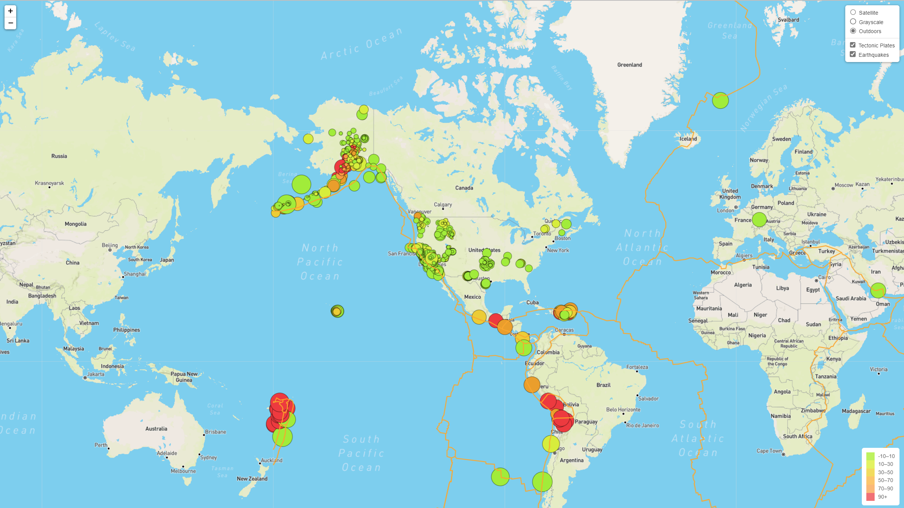

# leaflet-challenge

# Unit 15 Homework: Visualizing Data with Leaflet

### Part 1: Create the Earthquake Visualization

 [leaflet-challenge full page](https://hanatafesse.github.io/leaflet-challenge/)

Your first task is to visualize an earthquake dataset. Complete the following steps:

1. Get your dataset. To do so, follow these steps: 

   * The USGS provides earthquake data in a number of different formats, updated every five minutes. Visit the [USGS GeoJSON Feed](http://earthquake.usgs.gov/earthquakes/feed/v1.0/geojson.php) page and choose a dataset to visualize. The following image is an example screenshot of what appears when you visit this link:

    * When you click a dataset (such as "All Earthquakes from the Past 7 Days"), you will be given a JSON representation of that data. Use the URL of this JSON to pull in the data for the visualization. The following image is a sampling of earthquake data in JSON format:
2. Import and visualize the data by doing the following: 

   * Using Leaflet, create a map that plots all the earthquakes from your dataset based on their longitude and latitude.

       *  Your data markers should reflect the magnitude of the earthquake by their size and the depth of the earthquake by color. Earthquakes with higher magnitudes should appear larger, and earthquakes with greater depth should appear darker in color.

       * **Hint:** The depth of the earth can be found as the third coordinate for each earthquake.

   * Include popups that provide additional information about the earthquake when its associated marker is clicked.

   * Create a legend that will provide context for your map data.

   * Your visualization should look something like the preceding map.

[Leaflet-Step-1,(logic)](/leaflet-challenge/Leaflet-Step-1/static/js/logic.js)

### Part 2: Gather and Plot More Data (Optional)

The USGS wants you to plot a second dataset on your map to illustrate the relationship between tectonic plates and seismic activity. So, you will need to pull in this dataset and visualize it alongside your original data. Data on tectonic plates can be found at <https://github.com/fraxen/tectonicplates>.

The following image is an example screenshot of what the USGS would like you to produce:

Perform the following tasks: 

* Plot the tectonic plates dataset on the map in addition to the earthquakes.

* Add other base maps to choose from.

* Put each dataset into separate overlays that can be turned on and off independently.

* Add layer controls to our map.

[Leaflet-Step-2,(logic)](/leaflet-challenge/Leaflet-Step-2/static/js/logic.js)

[leaflet-challenge github page](https://github.com/HanaTafesse/leaflet-challenge)
